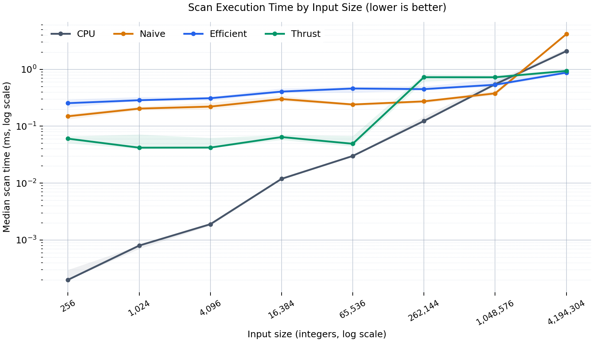
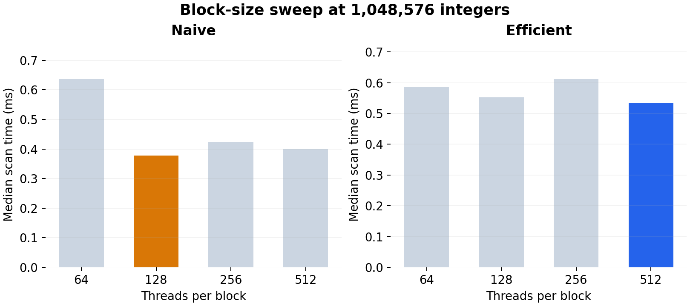
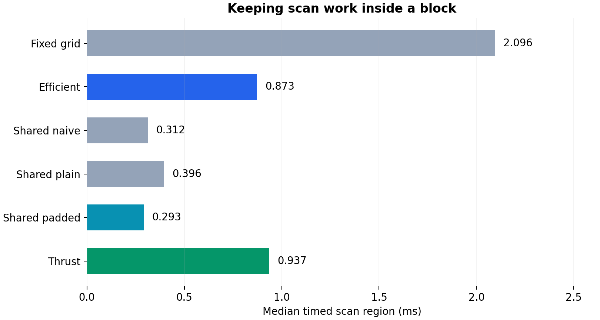
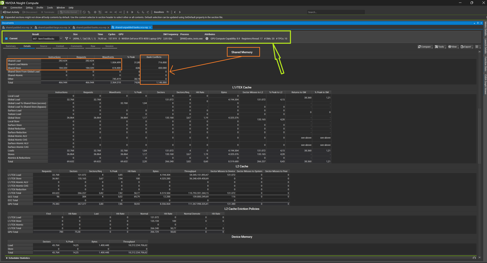
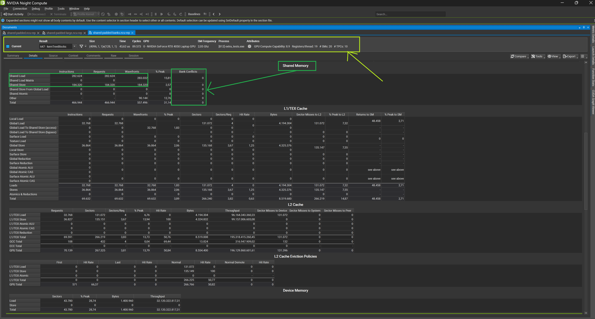
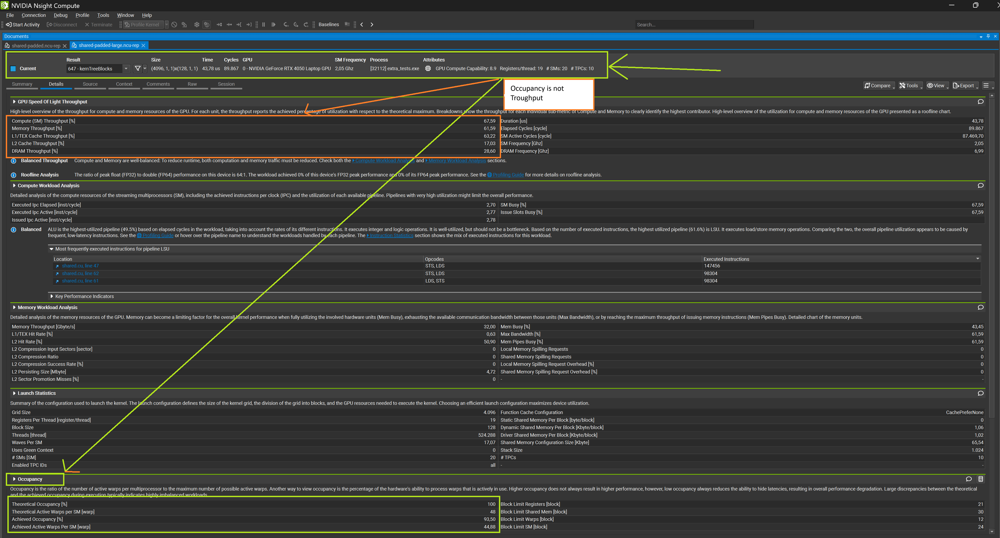
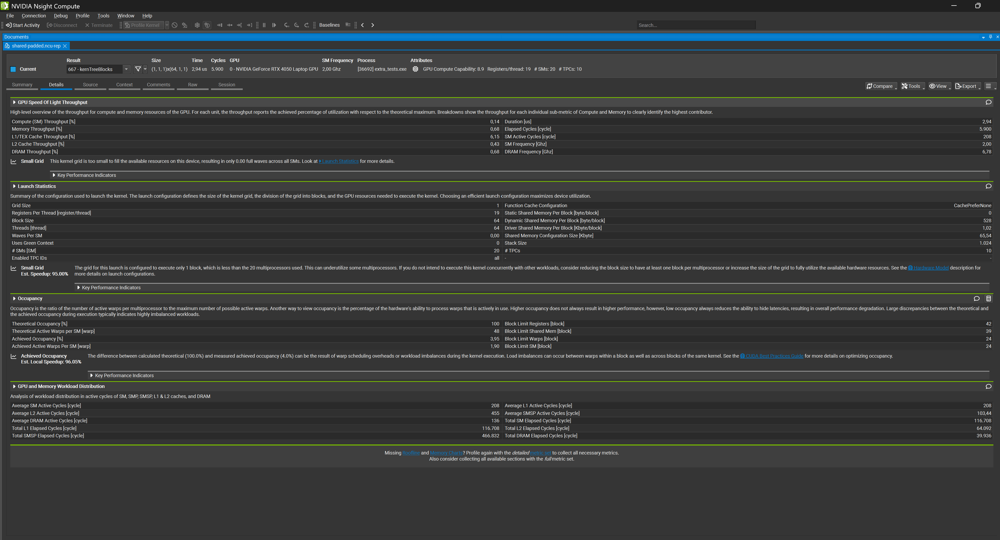
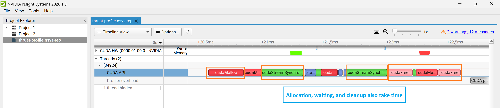
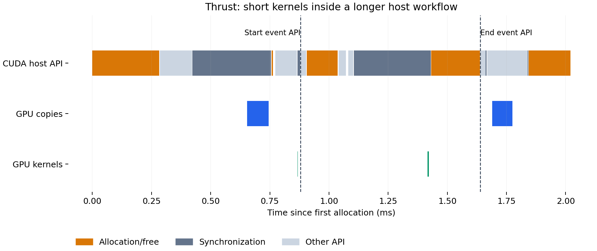

# CUDA Stream Compaction

**University of Pennsylvania, CIS 5650: GPU Programming and Architecture, Project 2 - Stream Compaction**

- Faris Rafie Syahzani
- Tested on: Windows 11, AMD Ryzen 7 8845HS, NVIDIA GeForce RTX 4050
  Laptop GPU (6 GB), 16 GB RAM

This project uses exclusive prefix sums to remove zeros from an array while preserving order. The same operation lets a renderer discard finished rays and spend later work on rays still in flight.

It compares CPU and CUDA scan algorithms, explores GPU optimizations, and uses scan to build a signed integer radix sort. The measurements and profiler captures explain when each approach helps and where it still spends time.

## Contents
- [How it works](#how-it-works)
  - [Scan and compaction in one example](#scan-and-compaction-in-one-example)
  - [Features and algorithms](#features-and-algorithms)
  - [Input handling](#input-handling)
- [Performance analysis](#performance-analysis)
  - [Main findings](#main-findings)
  - [How do the scan implementations compare?](#how-do-the-scan-implementations-compare)
  - [Which block sizes work best?](#which-block-sizes-work-best)
  - [Why do the results change with input size?](#why-do-the-results-change-with-input-size)
  - [What is slowing each version down?](#what-is-slowing-each-version-down)
  - [How were the measurements collected?](#how-were-the-measurements-collected)
- [Optimizations and radix sort](#optimizations-and-radix-sort)
  - [Why can a GPU scan be slower than a CPU loop?](#why-can-a-gpu-scan-be-slower-than-a-cpu-loop)
  - [Radix sort using scan](#radix-sort-using-scan)
  - [Shared memory and bank padding](#shared-memory-and-bank-padding)
- [Profiler evidence](#profiler-evidence)
  - [Does padding actually remove bank conflicts?](#does-padding-actually-remove-bank-conflicts)
  - [What does occupancy tell us?](#what-does-occupancy-tell-us)
  - [Why does a Thrust call take longer than its GPU kernels?](#why-does-a-thrust-call-take-longer-than-its-gpu-kernels)
  - [What the evidence does and does not show](#what-the-evidence-does-and-does-not-show)
- [Build and reproduce](#build-and-reproduce)
  - [Build and run the tests](#build-and-run-the-tests)
  - [Profile one scan call](#profile-one-scan-call)
  - [CMake changes](#cmake-changes)
  - [Local analysis workflow](#local-analysis-workflow)
- [Correctness and test output](#correctness-and-test-output)
  - [What was tested](#what-was-tested)
  - [Additional test results](#additional-test-results)
  - [Starter test output](#starter-test-output)
- [Takeaways](#takeaways)

## How it works

### Scan and compaction in one example

An **exclusive scan** writes the sum of all earlier elements. To remove zeros, first mark each nonzero value with 1 and each zero with 0. Scanning this mask gives each value we keep its output position.

```text
Input          [1, 5, 0, 1, 2, 0, 3]
Exclusive sum  [0, 1, 6, 6, 7, 9, 9]

Nonzero mask   [1, 1, 0, 1, 1, 0, 1]
Scan of mask   [0, 1, 2, 2, 3, 4, 4]
                       ↓ scatter retained values
Compacted      [1, 5, 1, 2, 3]          count = 5
```

For a nonempty input, the count is the last scanned index plus the last mask value. Negative values are kept. Only zeros are removed.

### Features and algorithms

In the table, `n` is the number of input elements and `B` is the number of threads per block. Algorithmic work describes how the operation count grows. It does not include the cost of launching kernels.

| Implementation | Approach | Algorithmic work |
|---|---|---|
| CPU scan | Serial running sum | O(n) |
| Naive GPU scan | Alternate between two buffers at offsets 1, 2, 4, …, then shift to exclusive output | O(n log n) |
| Efficient GPU scan | Blelloch up-sweep, zero root, down-sweep | O(n) |
| Thrust scan | `thrust::exclusive_scan` on device vectors | Library-managed |
| CPU compaction | Direct filtering, or a nonzero mask followed by the CPU scan helper and scatter | O(n) |
| GPU compaction | Common map kernel → efficient scan → common scatter kernel | O(n) |
| Shared naive scan | Hillis–Steele within blocks, followed by recursive scans of block totals | O(n log B), block size B |
| Shared tree scan | Blelloch within blocks, followed by recursive scans of block totals | O(n) |
| Radix sort | 32 stable binary partitions using efficient scan | O(32n) |

### Input handling

The global-memory efficient scan adds zeros until the working array reaches the next power of two. The shared-memory versions pad the last block, scan each block's total, and repeat that process when needed. CPU scan and compaction reuse a helper without its own timer so one timer does not start inside another.

Empty inputs return without touching output. Only the first returned `count` elements of compacted output are meaningful. Values and intermediate scan sums must fit in `int`. Arbitrary overlapping scan buffers are not supported.

## Performance analysis

### Main findings

**Efficient scan beats naive at the largest tested size, and shared memory goes further.** At 4,194,304 integers, global-memory efficient scan took 0.873 ms versus naive's 4.144 ms: **4.75× faster**. Padded shared-memory scan took **0.293 ms**, about **2.98× faster again**. At one million integers, naive still beats the global-memory efficient scan.

### How do the scan implementations compare?



Both axes use a logarithmic scale, so equal spacing represents a multiplication rather than a fixed increase. Lines show medians of 15 samples. Faint bands show samples 4 through 12 after sorting the 15 timings. This is roughly the middle half of the measurements, not a confidence interval. Lower is better. These are timed computation regions, **not full upload/compute/download latency**.

| Input integers | CPU (ms) | Naive (ms) | Efficient (ms) | Thrust (ms) |
|---:|---:|---:|---:|---:|
| 256 | 0.000200 | 0.149504 | 0.254048 | 0.060416 |
| 1,048,576 | 0.545800 | 0.377312 | 0.534688 | 0.723808 |
| 1,048,577 | 0.524000 | 0.401792 | 0.639296 | 0.786432 |
| 4,194,304 | 2.084200 | 4.143900 | 0.873248 | 0.937056 |

These results describe one machine in one measurement session. They are not a universal ranking. Raw samples and plotting tools remain local and are intentionally ignored by Git. Finished figures and numeric summaries are included.

### Which block sizes work best?



We swept 64, 128, 256, and 512 threads per block. At 1,048,576 elements, the lowest median time selected **128 for naive**, **512 for efficient**, and **128 for each shared-memory variant**. These settings stay fixed throughout the comparisons and are the defaults in the source. Thrust manages its own launches. Compaction inherits the efficient setting. No separate compaction performance tuning is claimed.

| Threads/block | Naive shared (ms) | Tree unpadded (ms) | Tree padded (ms) |
|---:|---:|---:|---:|
| 64 | 0.133216 | 0.153312 | 0.130080 |
| 128 | 0.114464 | 0.140512 | 0.111936 |
| 256 | 0.117472 | 0.149376 | 0.119840 |
| 512 | 0.126336 | 0.151392 | 0.122080 |

This is a rough tuning pass at one input size. The fastest block size varied across runs, so small timing differences should not be treated as a firm ranking. The largest block was not the fastest shared-memory configuration.

### Why do the results change with input size?

**Small inputs favor the CPU.** Its serial loop avoids GPU launch and scheduling overhead. CUDA event intervals include gaps between kernels, so these measurements are not sums of pure kernel durations.

**Less work does not always mean less time.** For `n = 2^k`, naive launches `k` scan kernels plus one shift. Efficient launches `2k` kernels plus a root reset. At one million elements that is 21 versus 40 launches. Near the root, efficient has very little useful parallel work. This helps explain the medium-size result despite its lower operation count. [GPU Gems Chapter 39](https://developer.nvidia.com/gpugems/gpugems3/part-vi-gpu-computing/chapter-39-parallel-prefix-sum-scan-cuda) derives the work-complexity difference.

**At the largest size, fewer full-array passes pay off.** Naive rereads and rewrites nearly the entire array at each level. Efficient processes progressively fewer nodes. The point where efficient scan overtakes naive scan is consistent with this reduction in memory traffic. We have not measured whether either global-memory method reaches its bandwidth limit or exactly how much time goes to memory versus launches. The efficient scan also accesses values farther apart at deeper levels, so fewer additions do not automatically mean equally fewer memory transactions.

**Doubling padding does not double runtime here.** Going from 1,048,576 to 1,048,577 doubles efficient scan's padded array, but its median rises about 19.6%. CPU timing also changes between these adjacent sizes, illustrating cache and measurement variability. This just-over-a-power-of-two input is listed in the table rather than added to the scaling graph.

### What is slowing each version down?

| Version | What the results suggest | What we can establish |
|---|---|---|
| CPU | The loop does more work as the input grows, but avoids GPU launch costs | It is fastest on the smallest inputs tested |
| Naive GPU | Many full-array reads and writes become expensive on large inputs | At four million elements, efficient scan is 4.75× faster |
| Global-memory efficient GPU | Many launches and little useful work near the root can outweigh the lower operation count | Reducing wasted threads improves the fixed-grid baseline by 2.77× at the same block size |
| Shared-memory tree | Bank conflicts make the unpadded kernel do extra memory work | Matched counters fall from 1,146,880 conflicts to zero with padding |
| Thrust | Allocation, synchronization, and scheduling add time around short kernels | The Systems trace shows these operations inside the timed call |

The memory and launch explanations for the global scans follow from the algorithms and timing patterns. They are not proof that a particular hardware unit is saturated. The padding comparison has direct counter evidence, and the Thrust discussion has a recorded timeline.

### How were the measurements collected?

| Item | Recorded configuration |
|---|---|
| GPU | RTX 4050 Laptop GPU, 6,141 MiB reported by the driver |
| CPU / memory | AMD Ryzen 7 8845HS / 16 GB RAM |
| Platform | Windows 11, Visual Studio 2022, MSVC 19.41 |
| CUDA / driver | 13.3 / 616.56 |
| Build | Release, C++17, no debugger, native GPU architecture |
| Sampling | 3 warm-ups + 15 samples per configuration |
| Input | Seed 565, values 0–3, same input per size across methods |
| Timing | Provided chrono timer for CPU, CUDA events for GPU |

The timers exclude initial memory allocation and input upload, as well as final output download and cleanup. Temporary buffers for recursive shared-memory scans are allocated before timing. Thrust's internal allocations within its scan call remain timed. Output validation and synchronization checks happen outside the timers.

Power mode, whether the laptop was plugged in, and background activity were not controlled. Running configurations in a fixed order can affect results through clock changes, cached data, and temperature. The shortest CPU timings are close to the timer's resolution. These measurements describe this laptop session. They do not establish hardware limits or statistically significant differences.

## Optimizations and radix sort



All bars use 4,194,304 integers with each method's configuration selected at one million.

### Why can a GPU scan be slower than a CPU loop?

**The short answer is because fewer additions do not guarantee a shorter runtime.** The CPU can start a simple loop immediately. Our global-memory GPU scans launch many kernels, and the tree scan runs out of useful parallel work near its root.

#### Why the basic approach wastes time

1. **Every launch has a cost.** At `n = 1,048,576`, the naive method launches 21 kernels. The efficient method launches 40 tree kernels and also resets the root. Even a pass with almost no arithmetic still needs to be scheduled.
2. **The tree gets narrower.** The up-sweep starts with `n / 2` useful node operations, then `n / 4`, and eventually just one. The down-sweep goes in the opposite direction. Near the root, there is not enough useful work to keep the whole GPU busy.
3. **A fixed launch grid creates threads that immediately exit.** Returning early avoids incorrect accesses and unnecessary arithmetic, but those blocks still have to be launched and scheduled. Many launched threads are not doing scan work.
4. **Global-memory accesses still cost time.** Each tree level reads and writes device memory. A lower addition count does not by itself tell us how efficiently those accesses are served.

This explains why the CPU wins on small inputs and why the naive scan can beat the work-efficient scan at medium sizes. We have not measured occupancy for each global-tree level, so the deeper-level explanation follows from the algorithm and launch sizes rather than a per-level counter experiment.

#### What we changed

The baseline, `Efficient::scanUnoptimized`, launches enough threads for the entire padded array at every level. Threads without a tree node return early.

The optimized version, `Efficient::scan`, assigns useful node operations to consecutive threads. If `n` is the padded length and `stride` is the current tree spacing, it uses:

```text
Useful threads = n / (2 × stride)
Blocks = ceil(useful threads / threads per block)
Right node index = (thread index + 1) × 2 × stride - 1
```

The grid shrinks during the up-sweep and grows during the down-sweep. The final partial block still needs a bounds check. This changes which thread handles a node, not the scan result.

#### Did the change help?

At the **same 512-thread block size**, fixed-grid scan took **2.422 ms** and compact-grid scan **0.873 ms**: **2.77× faster**. Independently tuning the baseline selected 128 threads, where it took 2.096 ms. The optimized version still wins by 2.40×. Launching fewer blocks reduces wasted work. It does not remove the cost of each launch or create extra useful work near the root.

### Radix sort using scan

**Goal:** demonstrate how scan can place values in the correct order during sorting.

`Radix::sort` sorts signed 32-bit integers in 32 passes, starting with the least significant bit. Each pass separates values by the current bit while preserving their relative order within each group. Each pass marks values whose current bit is zero, scans that mask with the efficient GPU helper, and places those values before values whose bit is one. Flipping the sign bit in the comparison key puts negative values first without changing stored values.

```cpp
#include <stream_compaction/radix.h>

int input[] = {3, -1, 0, 3, -7, 2};
int output[6];
StreamCompaction::Radix::sort(6, output, input);
```

```text
Radix example: -7 -1 0 2 3 3
```

This demonstrates scan as a sorting building block. No claim is made that this educational binary radix sort outperforms library sort. Tests compare with `std::stable_sort`, including integer extremes, duplicates, sorted/reversed inputs, empty input, and one million elements. The tests check sorted values only. Preserving the order of equal keys follows from the placement formula, but it is not independently tested with attached key/value pairs.

### Shared memory and bank padding

**Goal:** keep a tile's intermediate scan values close to its threads instead of repeatedly sending them through global memory.

`Shared::scanNaive` implements the shared-memory Hillis–Steele approach from GPU Gems Example 39.1. `Shared::scanUnpadded` implements the Blelloch block tree from Example 39.2. `Shared::scan` adds one padding word per 32 logical shared-memory words to reduce bank conflicts on the modern 32-bank device.

All three versions handle array sizes that do not fit evenly into blocks. They scan the block totals, repeating that process when needed, then add the sum of earlier blocks to each block's output.

| Variant | Threads/block | Elements/block | Dynamic shared memory/block | Median at 4,194,304 (ms) |
|---|---:|---:|---:|---:|
| Shared naive | 128 | 128 | 1,024 bytes | 0.312288 |
| Shared tree, unpadded | 128 | 256 | 1,024 bytes | 0.396224 |
| Shared tree, padded | 128 | 256 | 1,056 bytes | 0.292864 |

Padded tree scan is **1.35× faster** than the unpadded version at the same block size. The [matched Nsight Compute captures](#does-padding-actually-remove-bank-conflicts) independently show that padding removes reported shared-memory bank conflicts in the first large scan stage. This supports the explanation that padding helps by reducing conflicts. It does not prove that this counter explains every part of the whole-scan speedup.

At 128 threads, the tree processes 256 values per block. Four million values require three scan levels and two offset-add launches: five kernels instead of 44 global tree passes. Intermediate values used by each block's tree stay in shared memory. This reduces both global traffic and launch count.

Padded storage grows as `4 × (2B + floor(2B/32))` bytes per block. Higher shared-memory use can reduce resident blocks per SM. Register and thread limits matter too. A separate large padded-kernel capture measured **93.50% achieved occupancy** at 128 threads per block. It does not establish occupancy for the other block sizes in the sweep.

## Profiler evidence

Benchmarks answer **which implementation is faster**. Profilers help explain **where the time goes**. The sections below keep three measurements separate: the median time for a whole scan, the duration of one profiled kernel, and the time between CPU-side API calls.

### Does padding actually remove bank conflicts?

Nsight Compute 2026.2.1 captured the first `kernTreeBlocks` launch for each shared tree variant. Both used a Release build, **1,048,576 ones**, three warm-ups, **4,096 blocks × 128 threads**, kernel replay, and the full metric set. Each block scans 256 values. The two captures measure the same first stage. They do not include all recursive scan stages and the kernels that add block offsets.

| First-stage measurement | Unpadded | Padded |
|---|---:|---:|
| Kernel duration | 76.90 µs | **43.62 µs** |
| Shared load requests | 282,624 | 282,624 |
| Shared store requests | 184,320 | 184,320 |
| Shared load bank conflicts | 716,800 | **0** |
| Shared store bank conflicts | 430,080 | **0** |
| Shared load wavefronts | 1,004,499 | 283,032 |
| Shared store wavefronts | 614,400 | 184,320 |
| Registers/thread | 17 | 19 |

**The kernel asks for the same data, but memory needs less work to serve it.** The unpadded launch reports **1,146,880 bank conflicts**. The padded launch reports zero. Combined load/store wavefronts fall from 1,618,899 to 467,352, about **71.1% fewer**. These counts do not include the separate `Other` wavefront row. The profiler's bank-conflict column is used directly. Total wavefronts minus requests is not treated as an exact bank-conflict count.

Shared memory has 32 banks. Tree strides can send threads to different words in the same bank, which requires extra work to serve the accesses. The padded index `index + index / 32` changes that mapping. A wavefront is a unit of work needed to service memory accesses, not a CUDA warp. See NVIDIA's [shared-memory metric definitions](https://docs.nvidia.com/nsight-compute/ProfilingGuide/#shared-memory).

The observed kernel speedup is **76.90 / 43.62 = 1.76×**, or **43.3% less kernel time**, despite the padded kernel using two more registers per thread. This directly supports using bank padding for this configuration. These are individual profiler captures, not repeated-run averages. The **1.35× whole-scan benchmark speedup at four million elements** remains a separate result. Padding does not remove arithmetic, synchronization, or the remaining scan stages.

#### Original Nsight Compute screenshots

**Unpadded: bank conflicts and additional wavefronts.** Open the image at full size to read the counters. The header preserves the launch dimensions and duration.



**Padded: zero reported load/store bank conflicts for the matching launch.**



### What does occupancy tell us?

Occupancy measures active warps relative to the number an SM can hold. An SM is a GPU processing unit, and a warp is a group of 32 threads. Theoretical occupancy describes what the kernel's resource needs allow. Achieved occupancy describes what happened during execution.

A separate padded-kernel overview capture with the same large input and launch dimensions reports **100% theoretical occupancy**, **93.50% achieved occupancy**, **67.59% compute throughput**, and **28.60% DRAM throughput**. Its duration is 43.78 µs. It is not the 43.62 µs bank-table capture above.

At 128 threads per block, each block has four warps. The report permits 12 resident blocks per SM, giving 48 warps. Its achieved average is 44.88 warps, or `44.88 / 48 = 93.50%`. This large launch gives the GPU enough blocks to keep its SMs busy. High occupancy gives the scheduler more warps to choose from, but does not mean all instructions issue without stalls or that DRAM bandwidth is saturated.

For contrast, an exploratory **one-block, 64-thread** capture reports 100% theoretical but only **3.95% achieved occupancy** and a Small Grid warning. One block cannot spread across all 20 SMs. This shows why theoretical occupancy alone cannot tell us how much of the GPU will actually be used. Its input size and scan stage were not recorded, and its block size differs, so it is **not** a controlled small-versus-large speed comparison or direct evidence about the global scan's deeper tree levels.

#### Original occupancy screenshots





### Why does a Thrust call take longer than its GPU kernels?



The original Nsight Systems screenshot shows memory allocation, waits for GPU work to finish, memory cleanup, and copies around short GPU operations. At this zoom, kernel names are not readable. The figure built from recorded timestamps and the table below provide the detail. The visible interval includes the wrapper, so not every allocation or copy shown belongs inside the timed scan.



This figure is reconstructed from actual Nsight Systems timestamps for one warmed Thrust call on 262,144 ones. It includes wrapper allocation, upload, scan, download, and cleanup. Dashed markers are the **host calls that record timing events**, not device event completion timestamps. The profiler-start overhead is excluded from this view.

The capture contains three GPU kernels:

| Observed kernel | Duration |
|---|---:|
| CUB `static_kernel` during vector setup | 2.656 µs |
| CUB `DeviceScanInitKernel` | 1.056 µs |
| CUB `DeviceScanKernel` | 5.920 µs |

Between the two event-record API calls, the trace shows a temporary `cudaMalloc`, the scan initialization and scan launches, a `cudaStreamSynchronize`, and `cudaFree`. The timed Thrust call therefore includes more than the GPU's scan calculations. The two scan kernels total approximately **6.98 µs** in this profiled call. The event-record host calls are roughly **0.759 ms** apart. Those are different quantities and must not be substituted for the unprofiled benchmark median.

This shows that memory allocation, waiting, and scheduling contribute to the observed Thrust timings. It does **not** establish the exact cause of the size-dependent step in the scaling plot. A matched smaller-input trace would be needed. Times taken from the trace are kept separate from benchmark results because profiling changes how the program runs.

### What the evidence does and does not show

The figures show how runtime changes with input size, how block size affects performance, and how padding reduces bank conflicts. The Thrust timeline shows time spent outside GPU kernels. These observations do not identify every bottleneck. Comparing early and late global-tree passes, or small and large Thrust calls, would help explain the remaining differences. Those experiments have not been performed here. Profiler warnings suggest things to investigate. Their estimated speedups are not actual improvements measured by this project. See the [Systems guide](https://docs.nvidia.com/nsight-systems/UserGuide/) and [Compute guide](https://docs.nvidia.com/nsight-compute/ProfilingGuide/).

## Build and reproduce

### Build and run the tests

From the repository root, with CUDA and Visual Studio C++ tools installed:

```powershell
cmake -S . -B build
cmake --build build --config Release
ctest --test-dir build -C Release --output-on-failure
.\build\bin\Release\cis5650_stream_compaction_test.exe
```

### Profile one scan call

The `extra_tests` target is included in the repository and registered with CTest. You can profile one warmed call without running the full test suite:

```powershell
.\build\bin\Release\extra_tests.exe --profile thrust 262144
```

Supported profile method names are `thrust`, `efficient`, `shared`, `shared-unpadded`, and `naive`. The program warms up three calls, then surrounds one call with `cudaProfilerStart/Stop`. Enable CUDA tracing and capture that range in Nsight Systems.

For the matched Nsight Compute comparison, use the Release `extra_tests.exe` with arguments `--profile shared 1048576`, then `--profile shared-unpadded 1048576`. Set **Profile From Start: No**, **Replay Mode: Kernel**, **Kernel Name Base: Function**, **Kernel Name: kernTreeBlocks**, both launch skip counts to **0**, and launch capture count to **1**. Select the **full** metric set, including `MemoryWorkloadAnalysis_Tables`, and save separate reports. Expand Memory Workload Analysis to show its Shared Memory table. Raw `.ncu-rep` files stay in the ignored `analysis/` directory. The original GUI screenshots and transcribed values are included here.

### CMake changes

- The library includes the radix-sort and shared-memory modules.
- The root build adds `extra_tests` and registers it with CTest.
- A local `analysis` target is created only when its ignored source file exists.
- The MSVC-only `/Zc:preprocessor` option is passed through NVCC for CUDA and Thrust compatibility.
- Both host and CUDA sources use C++17. The CMake 3.18–3.22 compatibility branch has its target-name typo corrected (`stream_compaction`, without a trailing brace).
- During automation, duplicate `PATH` and `Path` entries had to be combined into one entry in the build process's environment.

### Local analysis workflow

The directories `analysis/`, `scripts/`, and the source `src/analysis.cpp` are ignored as requested. They stay on this computer but are absent from a fresh clone. The repository builds and tests without them. Finished PNG figures remain included.

On this working copy, measurements and plots can be regenerated with:

```powershell
.\build\bin\Release\analysis.exe analysis/results.json
python scripts/plot_results.py
python scripts/plot_profile.py
```

Plotting used Matplotlib 3.9.2. The profiler plot consumes the local SQLite export of `analysis/thrust-profile.nsys-rep`. If the data changes, update the report's tables and conclusions too.

For a controlled follow-up: connect AC power, record power mode, close GPU workloads, rerun the block sweep, randomize configuration order, and repeat the selected configurations in another session. Then capture matched small/large Thrust calls to test the dispatch/overhead explanation. Collect hardware counters separately. Never mix profiled durations into the benchmark graph.

## Correctness and test output

### What was tested

The test output and benchmark checks below passed. Profiling captures are separate from these correctness results.

The local test harness compares results with independent `std::exclusive_scan` and `std::copy_if` references. It checks output values, compaction counts, and a marker at the end of the allocated output to catch writes beyond the input length. Every timed scan output is also checked across all block-size candidates. The included `extra_tests` suite additionally checks that the entire output tail after a compaction's returned count remains untouched.

```text
PASS: 528 independent scan/compaction checks
Sizes: 0, 1, 2, 3, 127, 128, 129, 253, 256, 257, 10000, 1000000
Patterns: zeros, ones, mixed signed values, trailing zero
Measured n=256
Measured n=1024
Measured n=4096
Measured n=16384
Measured n=65536
Measured n=262144
Measured n=1048576
Measured n=1048577
Measured n=4194304
```

### Additional test results

A fresh Release build in `build/audit` passed CTest on the RTX 4050. The included `extra_tests` executable checks all four required scans and all three required compaction methods against independent standard-library references. Its 336 required checks cover the 12 sizes and four patterns listed above, including one million elements and empty inputs. It verifies compaction counts and ensures the unused output tail is untouched. These checks run from a fresh clone without the ignored analysis harness.

It also exercises all three shared scans and the fixed-grid baseline at four block sizes, then signed radix sorting:

```text
PASS: 336 required scan/compaction checks
Radix example: -7 -1 0 2 3 3
PASS: 1058 extra-credit checks
```

Inactive threads can overflow an integer while calculating a tree index for large inputs. Kernels avoid this by returning before calculating an inactive node's index. The full test sweep passed. No memory-sanitizer run is claimed.

### Starter test output

<details>
<summary>Expand the original Release test output</summary>

These single-call timings are correctness-run output, not the repeated samples used in the graphs.

```text
****************
** SCAN TESTS **
****************
    [  21  13   3   2  37  29   1   5  26  16  43  37  26 ...  32   0 ]
==== cpu scan, power-of-two ====
   elapsed time: 0.0009ms    (std::chrono Measured)
    [   0  21  34  37  39  76 105 106 111 137 153 196 233 ... 5931 5963 ]
==== cpu scan, non-power-of-two ====
   elapsed time: 0.0002ms    (std::chrono Measured)
    [   0  21  34  37  39  76 105 106 111 137 153 196 233 ... 5861 5893 ]
    passed
==== naive scan, power-of-two ====
   elapsed time: 0.321536ms    (CUDA Measured)
    passed
==== naive scan, non-power-of-two ====
   elapsed time: 0.666624ms    (CUDA Measured)
    passed
==== work-efficient scan, power-of-two ====
   elapsed time: 0.494592ms    (CUDA Measured)
    passed
==== work-efficient scan, non-power-of-two ====
   elapsed time: 0.231424ms    (CUDA Measured)
    passed
==== thrust scan, power-of-two ====
   elapsed time: 0.20992ms    (CUDA Measured)
    passed
==== thrust scan, non-power-of-two ====
   elapsed time: 0.073728ms    (CUDA Measured)
    passed

*****************************
** STREAM COMPACTION TESTS **
*****************************
    [   3   0   1   2   0   1   0   0   1   3   3   3   0 ...   1   0 ]
==== cpu compact without scan, power-of-two ====
   elapsed time: 0.0011ms    (std::chrono Measured)
    [   3   1   2   1   1   3   3   3   1   3   3   2   2 ...   1   1 ]
    passed
==== cpu compact without scan, non-power-of-two ====
   elapsed time: 0.0005ms    (std::chrono Measured)
    [   3   1   2   1   1   3   3   3   1   3   3   2   2 ...   3   3 ]
    passed
==== cpu compact with scan ====
   elapsed time: 0.0012ms    (std::chrono Measured)
    [   3   1   2   1   1   3   3   3   1   3   3   2   2 ...   1   1 ]
    passed
==== work-efficient compact, power-of-two ====
   elapsed time: 0.407552ms    (CUDA Measured)
    passed
==== work-efficient compact, non-power-of-two ====
   elapsed time: 0.41472ms    (CUDA Measured)
Press any key to continue . . .
    passed
```

</details>

## Takeaways

- A GPU is not automatically faster for small inputs. Kernel launches can cost more time than the scan itself.
- Doing fewer additions helps at large sizes, but launch count and memory access patterns still matter.
- Launching only useful threads reduces wasted work. Shared memory goes further by keeping intermediate values within a block.
- Padding removes the reported bank conflicts in the matched captures. The full-scan benchmarks show a separate, smaller speedup.
- A fast GPU kernel does not guarantee a fast library call. Allocation, synchronization, and scheduling also contribute to runtime.
