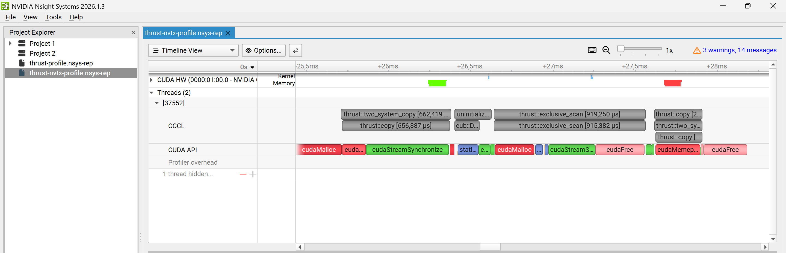

# CUDA Stream Compaction

**University of Pennsylvania, CIS 5650: GPU Programming and Architecture, Project 2 - Stream Compaction**

- Faris Rafie Syahzani
- Tested on: Windows 11, AMD Ryzen 7 8845HS, NVIDIA GeForce RTX 4050
  Laptop GPU (6 GB), 16 GB RAM

This project uses exclusive prefix sums to remove zeros from an array while preserving order. The same operation lets a renderer discard finished rays and spend later work on rays still in flight.

The project compares CPU and CUDA scan algorithms, improves GPU scan with shared memory, and uses scan to build a signed integer radix sort. The results show how input size, kernel launches, and memory access affect performance.

## Contents

- [How it works](#how-it-works)
  - [Scan and compaction in one example](#scan-and-compaction-in-one-example)
  - [Features and algorithms](#features-and-algorithms)
  - [Input handling](#input-handling)
- [Performance analysis](#performance-analysis)
  - [Main findings](#main-findings)
  - [How do the scan implementations compare?](#how-do-the-scan-implementations-compare)
  - [Which block sizes work best?](#which-block-sizes-work-best)
  - [Why do the results change with input size?](#why-do-the-results-change-with-input-size)
  - [What is slowing each version down?](#what-is-slowing-each-version-down)
  - [How were the measurements collected?](#how-were-the-measurements-collected)
- [Optimizations and radix sort](#optimizations-and-radix-sort)
  - [Why can a GPU scan be slower than a CPU loop?](#why-can-a-gpu-scan-be-slower-than-a-cpu-loop)
  - [Radix sort using scan](#radix-sort-using-scan)
  - [Shared memory and bank padding](#shared-memory-and-bank-padding)
- [Profiler evidence](#profiler-evidence)
  - [Does padding actually remove bank conflicts?](#does-padding-actually-remove-bank-conflicts)
  - [What does occupancy tell us?](#what-does-occupancy-tell-us)
  - [Why does a Thrust call take longer than its GPU kernels?](#why-does-a-thrust-call-take-longer-than-its-gpu-kernels)
  - [What the evidence does and does not show](#what-the-evidence-does-and-does-not-show)
- [Build and reproduce](#build-and-reproduce)
  - [Build and run the tests](#build-and-run-the-tests)
  - [Profile one scan call](#profile-one-scan-call)
  - [CMake changes](#cmake-changes)
- [Correctness and test output](#correctness-and-test-output)
  - [What was tested](#what-was-tested)
  - [Additional test results](#additional-test-results)
  - [Starter test output](#starter-test-output)
- [Takeaways](#takeaways)

## How it works

### Scan and compaction in one example

An **exclusive scan** writes the sum of all earlier elements. To remove zeros, first mark each nonzero value with 1 and each zero with 0. Scanning this mask gives each retained value its output position.

```text
Input          [1, 5, 0, 1, 2, 0, 3]
Exclusive sum  [0, 1, 6, 6, 7, 9, 9]

Nonzero mask   [1, 1, 0, 1, 1, 0, 1]
Scan of mask   [0, 1, 2, 2, 3, 4, 4]
                       ↓ scatter retained values
Compacted      [1, 5, 1, 2, 3]          count = 5
```

For a nonempty input, the count is the last scanned index plus the last mask value. Negative values are kept. Only zeros are removed.

### Features and algorithms

In the table, `n` is the number of input elements and `B` is the number of threads per block. Algorithmic work describes how the operation count grows. It does not include the cost of launching kernels.

| Implementation | Approach | Algorithmic work |
|---|---|---|
| CPU scan | Serial running sum | O(n) |
| Naive GPU scan | Alternate between two buffers at offsets 1, 2, 4, …, then shift to exclusive output | O(n log n) |
| Efficient GPU scan | Blelloch up-sweep, zero root, down-sweep | O(n) |
| Thrust scan | `thrust::exclusive_scan` on device vectors | Library-managed |
| CPU compaction | Direct filtering, or a nonzero mask followed by the CPU scan helper and scatter | O(n) |
| GPU compaction | Common map kernel → efficient scan → common scatter kernel | O(n) |
| Shared naive scan | Hillis–Steele within blocks, followed by recursive scans of block totals | O(n log B), block size B |
| Shared tree scan | Blelloch within blocks, followed by recursive scans of block totals | O(n) |
| Radix sort | 32 stable binary partitions using efficient scan | O(32n) |

### Input handling

All implementations support both power-of-two and non-power-of-two input sizes. The global-memory efficient scan pads its working array with zeros to reach the next power of two. The shared-memory versions pad the last block and scan the block totals to combine results across blocks.

Empty inputs return without touching output. Only the first returned `count` elements of compacted output are meaningful. Values and intermediate scan sums must fit in `int`. Arbitrary overlapping scan buffers are not supported.

## Performance analysis

### Main findings

**Efficient scan beats naive at the largest tested size, and shared memory goes further.** At 4,194,304 integers, global-memory efficient scan took 0.873 ms versus naive's 4.144 ms: **4.75× faster**. Padded shared-memory scan took **0.293 ms**, about **2.98× faster again**. At one million integers, naive still beats the global-memory efficient scan.

### How do the scan implementations compare?

**Among the four required implementations, the CPU is fastest for small inputs, naive GPU scan is fastest at about one million elements, and efficient GPU scan is fastest at about four million.** Thrust's performance depends on the overhead of the complete library call as well as its GPU kernels.


Lower values mean faster scans. Both axes use a logarithmic scale to show the wide range of sizes and runtimes. Each line shows the median of 15 samples. The faint band covers samples 4 through 12 after sorting by duration, showing the spread of the measurements. The timings exclude initial allocation, input upload, output download, and cleanup.

| Input integers | CPU (ms) | Naive (ms) | Efficient (ms) | Thrust (ms) |
|---:|---:|---:|---:|---:|
| 256 | 0.000200 | 0.149504 | 0.254048 | 0.060416 |
| 1,048,576 | 0.545800 | 0.377312 | 0.534688 | 0.723808 |
| 1,048,577 | 0.524000 | 0.401792 | 0.639296 | 0.786432 |
| 4,194,304 | 2.084200 | 4.143900 | 0.873248 | 0.937056 |

These measurements describe the tested RTX 4050 laptop. The fastest method can change with the hardware and input size. The repository includes the figures and numeric summaries. Raw benchmark samples and plotting scripts are not distributed.

### Which block sizes work best?


**The selected block sizes are 128 threads for naive scan, 512 for efficient scan, and 128 for each shared-memory variant.** These gave the lowest median times at 1,048,576 elements among the tested sizes of 64, 128, 256, and 512 threads. Each selected size stays fixed throughout the scaling comparison and is the default in the source. Thrust chooses its own launch configuration. Compaction uses the efficient scan setting and was not tuned separately.

| Threads/block | Naive shared (ms) | Tree unpadded (ms) | Tree padded (ms) |
|---:|---:|---:|---:|
| 64 | 0.133216 | 0.153312 | 0.130080 |
| 128 | 0.114464 | 0.140512 | 0.111936 |
| 256 | 0.117472 | 0.149376 | 0.119840 |
| 512 | 0.126336 | 0.151392 | 0.122080 |

Larger blocks were not always faster. Block size affects how work is divided and how many blocks can run on each GPU processing unit. The selected values are a rough optimization for this input size. Small differences varied across runs.

### Why do the results change with input size?

**Small inputs favor the CPU because it avoids GPU launch overhead.** A short serial loop can finish before the GPU has been given enough work to offset the cost of launching kernels.

**Naive scan can beat efficient scan because it launches fewer kernels.** For `n = 2^k`, naive launches `k` scan kernels plus one shift. Efficient launches `2k` kernels and resets the tree's root. At 1,048,576 elements, that is 21 versus 40 launches. Efficient scan also has very little parallel work near the root. These costs help explain why it can take longer even though it performs fewer additions. [GPU Gems Chapter 39](https://developer.nvidia.com/gpugems/gpugems3/part-vi-gpu-computing/chapter-39-parallel-prefix-sum-scan-cuda) explains the difference in operation counts.

**Efficient scan benefits more from large inputs because it does less total work.** Naive rereads and rewrites nearly the entire array at every level. Efficient processes progressively fewer tree nodes, reducing additions and memory traffic. This helps explain its advantage at four million elements. The exact split between launch overhead and memory access time was not measured.

**Padding adds work for non-power-of-two inputs.** Increasing the input from 1,048,576 to 1,048,577 doubles the efficient scan's padded array. Its measured runtime rises by about 19.6%. Runtime does not grow in direct proportion to storage because launch overhead and the amount of work at each tree level also matter. This extra input size appears in the table.

### What is slowing each version down?

| Version | Costs suggested by the results | Supporting result |
|---|---|---|
| CPU | The loop does more work as the input grows, but avoids GPU launch costs | It is fastest on the smallest inputs tested |
| Naive GPU | Many full-array reads and writes become expensive on large inputs | At four million elements, efficient scan is 4.75× faster |
| Global-memory efficient GPU | Many launches and little useful work near the root can outweigh the lower operation count | Reducing wasted threads improves the fixed-grid baseline by 2.77× at the same block size |
| Shared-memory tree | Bank conflicts make the unpadded kernel do extra memory work | Matched counters fall from 1,146,880 conflicts to zero with padding |
| Thrust | Allocation, synchronization, and scheduling add time around short kernels | The Systems trace shows these operations inside the timed call |

For the global scans, these explanations follow from the algorithms and timing patterns. Hardware counters were collected for the shared-memory padding comparison, and the Thrust timeline shows operations inside the library call. The results do not establish that the global scans reach the GPU's memory bandwidth limit.

### How were the measurements collected?

| Item | Recorded configuration |
|---|---|
| GPU | RTX 4050 Laptop GPU, 6,141 MiB reported by the driver |
| CPU / memory | AMD Ryzen 7 8845HS / 16 GB RAM |
| Platform | Windows 11, Visual Studio 2022, MSVC 19.41 |
| CUDA / driver | 13.3 / 616.56 |
| Build | Release, C++17, no debugger, native GPU architecture |
| Sampling | 3 warm-ups + 15 samples per configuration |
| Input | Seed 565, values 0–3, same input per size across methods |
| Timing | Provided chrono timer for CPU, CUDA events for GPU |

CPU scans use a host timer, and GPU scans use CUDA events. Initial allocation, input upload, output download, and cleanup are excluded. Shared-memory scan buffers are also allocated before timing. Allocations performed internally by `thrust::exclusive_scan` remain part of its measured cost. Each result is checked after timing. CUDA-event intervals include gaps between kernels as well as kernel execution.

Power mode, AC power, and background activity were not controlled. Configurations ran in a fixed order, so temperature, clock speed, and cached data may affect the results. The shortest CPU timings are also close to the timer's resolution. Large differences are more useful here than small differences between nearby measurements.

## Optimizations and radix sort


All bars use 4,194,304 integers with each method's configuration selected at one million.

### Why can a GPU scan be slower than a CPU loop?

**GPU launch overhead and idle threads can cost more time than a small CPU scan.** The CPU runs one simple loop. The global-memory efficient scan launches a kernel for every tree level, including levels with only a few useful operations.

#### Why the basic approach wastes time

1. **Every launch has a cost.** At `n = 1,048,576`, the naive method launches 21 kernels. The efficient method launches 40 tree kernels and also resets the root. Even a pass with almost no arithmetic still needs to be scheduled.
2. **The tree gets narrower.** The up-sweep starts with `n / 2` useful node operations, then `n / 4`, and eventually just one. The down-sweep goes in the opposite direction. Near the root, there is not enough useful work to keep the whole GPU busy.
3. **A fixed launch grid creates threads that immediately exit.** Returning early avoids incorrect accesses and unnecessary arithmetic, but those blocks still have to be launched and scheduled. Many launched threads are not doing scan work.
4. **Global-memory accesses still cost time.** Each tree level reads and writes device memory. A lower addition count does not by itself tell us how efficiently those accesses are served.

These costs explain how an algorithm with fewer additions can still take longer. The shrinking amount of work follows from the tree structure. Occupancy was not measured separately at each tree level.

#### How the optimization works

The baseline, `Efficient::scanUnoptimized`, launches enough threads for the entire padded array at every level. Threads without a tree node return early.

The optimized version, `Efficient::scan`, assigns useful node operations to consecutive threads. If `n` is the padded length and `stride` is the current tree spacing, it uses:

```text
Useful threads = n / (2 × stride)
Blocks = ceil(useful threads / threads per block)
Right node index = (thread index + 1) × 2 × stride - 1
```

The grid shrinks during the up-sweep and grows during the down-sweep. The final partial block still needs a bounds check. This changes which thread handles a node, not the scan result.

#### Did the change help?

**Launching only the threads needed for each level made efficient scan 2.77× faster at 4,194,304 elements.** At the same 512-thread block size, the fixed-grid version took **2.422 ms**, while the optimized version took **0.873 ms**. The baseline's best tested block size was 128 threads, with a time of 2.096 ms. The optimized version is still 2.40× faster than that result. It reduces wasted work, although each tree level still needs a separate launch.

### Radix sort using scan

Radix sort uses scan to calculate where each value belongs in the output.

`Radix::sort` sorts signed 32-bit integers in 32 passes, starting with the least significant bit. Each pass separates values by the current bit while preserving their relative order within each group. Each pass marks values whose current bit is zero, scans that mask with the efficient GPU helper, and places those values before values whose bit is one. Flipping the sign bit in the comparison key puts negative values first without changing stored values.

```cpp
#include <stream_compaction/radix.h>

int input[] = {3, -1, 0, 3, -7, 2};
int output[6];
StreamCompaction::Radix::sort(6, output, input);
```

```text
Radix example: -7 -1 0 2 3 3
```

Tests compare the output with `std::stable_sort` for integer extremes, duplicates, sorted and reversed inputs, empty input, and one million elements. Stability follows from preserving input order during each partition. The tests verify sorted values without attached key/value pairs. This implementation demonstrates scan's role in sorting. Sorting performance was not compared with a library implementation.

### Shared memory and bank padding

Shared-memory scan keeps intermediate values within each block. This reduces global-memory traffic and the number of kernel launches.

`Shared::scanNaive` implements the shared-memory Hillis–Steele approach from GPU Gems Example 39.1. `Shared::scanUnpadded` implements the Blelloch block tree from Example 39.2. `Shared::scan` adds one padding word per 32 logical shared-memory words to reduce bank conflicts on the modern 32-bank device.

All three versions handle array sizes that do not fit evenly into blocks. They scan the block totals, repeating that process when needed, then add the sum of earlier blocks to each block's output.

| Variant | Threads/block | Elements/block | Dynamic shared memory/block | Median at 4,194,304 (ms) |
|---|---:|---:|---:|---:|
| Shared naive | 128 | 128 | 1,024 bytes | 0.312288 |
| Shared tree, unpadded | 128 | 256 | 1,024 bytes | 0.396224 |
| Shared tree, padded | 128 | 256 | 1,056 bytes | 0.292864 |

Padded tree scan is **1.35× faster** than the unpadded version at the same block size. The [Nsight Compute comparison](#does-padding-actually-remove-bank-conflicts) shows why padding helps. It removes the reported bank conflicts in the first scan stage, allowing shared-memory requests to be served with less work.

At 128 threads, the tree processes 256 values per block. Four million values require three scan levels and two offset-add launches: five kernels instead of 44 global tree passes. Intermediate values used by each block's tree stay in shared memory. This reduces both global traffic and launch count.

For `B` threads, padded storage uses `4 × (2B + floor(2B/32))` bytes per block. Increasing shared-memory use can limit how many blocks fit on one streaming multiprocessor, or SM. Registers and thread counts also affect this limit. At 128 threads per block, the large padded-kernel capture measured **93.50% achieved occupancy**. Other block sizes may have different occupancy.

## Profiler evidence

The benchmarks compare complete scans. The profiler captures explain the costs inside them, including bank conflicts, GPU utilization, and operations performed by Thrust. A single kernel's duration and a CPU library call's duration measure different parts of the work.

### Does padding actually remove bank conflicts?

**Padding reduced the reported bank conflicts from 1,146,880 to zero in the measured kernel.** Its duration fell from **76.90 µs to 43.62 µs**, a **1.76× speedup**.

Nsight Compute 2026.2.1 measured the first `kernTreeBlocks` launch for both shared tree variants. Each used a Release build, **1,048,576 ones**, three warm-ups, and **4,096 blocks of 128 threads**. Each block scans 256 values. These captures use kernel replay and the full metric set, and cover only the first scan stage.

| First-stage measurement | Unpadded | Padded |
|---|---:|---:|
| Kernel duration | 76.90 µs | **43.62 µs** |
| Shared load requests | 282,624 | 282,624 |
| Shared store requests | 184,320 | 184,320 |
| Shared load bank conflicts | 716,800 | **0** |
| Shared store bank conflicts | 430,080 | **0** |
| Shared load wavefronts | 1,004,499 | 283,032 |
| Shared store wavefronts | 614,400 | 184,320 |
| Registers/thread | 17 | 19 |

Both kernels issue the same number of shared-memory load and store requests. With padding, those requests need fewer service operations, called wavefronts. Combined load and store wavefronts fall from 1,618,899 to 467,352, about **71.1% fewer**. This total excludes the profiler's `Other` row. Bank-conflict counts come directly from the profiler's bank-conflict column.

Shared memory has 32 banks. Tree strides can send threads to different words in the same bank, which requires extra work to serve the accesses. The padded index `index + index / 32` changes that mapping. A wavefront is a unit of work needed to service memory accesses, not a CUDA warp. See NVIDIA's [shared-memory metric definitions](https://docs.nvidia.com/nsight-compute/ProfilingGuide/#shared-memory).

The complete scan improves by **1.35× at four million elements**, less than the **1.76×** improvement in this individual kernel capture. The full operation also includes other scan stages, synchronization, and kernels that add block offsets. Padding reduces bank conflicts but leaves those costs in place. The kernel figures are individual profiler measurements, while the full-scan figures are medians from repeated benchmarks.

#### Nsight Compute screenshots

**Unpadded: bank conflicts and additional wavefronts.** Open the image at full size to read the counters. The header preserves the launch dimensions and duration.


**Padded: zero reported load/store bank conflicts for the matching launch.**


### What does occupancy tell us?

**Occupancy shows how much of an SM's capacity for active warps is being used.** A warp is a group of 32 threads. Higher occupancy gives the GPU more warps to choose from when others are waiting. It does not guarantee faster execution because memory access, instruction dependencies, and synchronization still matter.

Theoretical occupancy is the limit allowed by a kernel's resource needs. Achieved occupancy is the measured use of that capacity during execution.

The large padded-kernel overview reports **100% theoretical occupancy** and **93.50% achieved occupancy**. It also reports **67.59% compute throughput** and **28.60% DRAM throughput**. This capture uses the same input and launch dimensions as the padding comparison, with a measured duration of 43.78 µs.

At 128 threads per block, each block has four warps. The report permits 12 resident blocks per SM, giving 48 warps. Its achieved average is 44.88 warps, or `44.88 / 48 = 93.50%`. This large launch provides enough blocks to make use of most of the available warp capacity.

A **one-block, 64-thread** capture reports 100% theoretical occupancy but only **3.95% achieved occupancy**, along with a Small Grid warning. One block cannot spread across all 20 SMs. This illustrates why a kernel can have a high theoretical occupancy limit while leaving much of the GPU idle. The input size and scan stage were not recorded, so this image illustrates the small-grid problem without providing a controlled performance comparison.

#### Occupancy screenshots


### Why does a Thrust call take longer than its GPU kernels?

**Thrust also allocates temporary memory, launches the kernels, waits for GPU work to finish, and frees the temporary memory.** The time spent inside `thrust::exclusive_scan` includes all of these operations. Adding up the GPU kernel durations counts only the work executing on the GPU.



In this capture, one scan of **262,144 ones**, after three warm-up calls, takes **919.250 µs** inside the CPU library call. Its two GPU scan kernels take **6.944 µs** in total. Most of the call's elapsed time is therefore spent outside those kernels. The timeline shows temporary allocation, synchronization, and cleanup contributing to that difference, along with time between GPU operations.

To read the screenshot, follow the `thrust::exclusive_scan` bar in the **CCCL** row. Directly below it, the **CUDA API** row shows `cudaMalloc`, kernel launches, `cudaStreamSynchronize`, and `cudaFree`. The two nested scan bars represent layers of the same CPU call. The **CUDA HW** row shows the much shorter GPU activity. Copy and initialization bars outside the scan range belong to input setup and output transfer.

The exported trace identifies the two scan kernels as `DeviceScanInitKernel` and `DeviceScanKernel`. A separate `static_kernel` initializes the output vector before the scan. Their names are too small to read at this zoom level. These profiled durations explain the difference between a library call and its kernels. The performance graph uses separate, unprofiled CUDA-event measurements because profiling adds overhead.

### What the evidence does and does not show

The measurements support three conclusions. Input size changes which scan is fastest, padding removes the reported conflicts in the measured shared-memory kernel, and Thrust spends time on operations around its GPU kernels.

The exact memory-bandwidth limit of the global scans and the cause of Thrust's sudden timing increase in the scaling plot remain unmeasured. Resolving them would require hardware counters for the global scans and comparable Thrust traces at smaller and larger sizes. See the [Systems guide](https://docs.nvidia.com/nsight-systems/UserGuide/) and [Compute guide](https://docs.nvidia.com/nsight-compute/ProfilingGuide/) for the profiler metrics.

## Build and reproduce

### Build and run the tests

From the repository root, with CUDA and Visual Studio C++ tools installed:

```powershell
cmake -S . -B build
cmake --build build --config Release
ctest --test-dir build -C Release --output-on-failure
.\build\bin\Release\cis5650_stream_compaction_test.exe
```

### Profile one scan call

The `extra_tests` target is included in the repository and registered with CTest. You can profile one warmed call without running the full test suite:

```powershell
.\build\bin\Release\extra_tests.exe --profile thrust 262144
```

Supported profile method names are `thrust`, `efficient`, `shared`, `shared-unpadded`, and `naive`. The program warms up three calls, then surrounds one call with `cudaProfilerStart/Stop`. In Nsight Systems, enable both **CUDA** and **NVTX** tracing and capture the **CUDA profiler API** range. CPU sampling and context-switch tracing are unnecessary for this view.

With `nsys` on your PATH, capture the Thrust call using:

```powershell
nsys profile --trace=cuda,nvtx --sample=none --cpuctxsw=none --capture-range=cudaProfilerApi --capture-range-end=stop --output=thrust-nvtx-profile .\build\bin\Release\extra_tests.exe --profile thrust 262144
```

Open the resulting report and expand the calling thread's **CCCL** NVTX row, **CUDA API** row, and the GPU's kernel/stream rows. Zoom to `thrust::exclusive_scan` while keeping nearby allocations and copies visible. The CUDA 13.3 headers used for this project supply Thrust's CCCL annotations automatically. See the [Nsight Systems guide](https://docs.nvidia.com/nsight-systems/UserGuide/) for tracing options.

To reproduce the Nsight Compute padding comparison, profile the Release `extra_tests.exe` with `--profile shared 1048576` and `--profile shared-unpadded 1048576` in separate runs. Use these settings:

| Setting | Value |
|---|---|
| Profile From Start | No |
| Replay Mode | Kernel |
| Kernel Name Base | Function |
| Kernel Name | kernTreeBlocks |
| Both launch skip counts | 0 |
| Launch capture count | 1 |
| Metric set | Full, including `MemoryWorkloadAnalysis_Tables` |

Open the Shared Memory table under Memory Workload Analysis to compare bank conflicts. The screenshots above preserve the measured counters and launch dimensions.

### CMake changes

- The library includes the radix-sort and shared-memory modules.
- The root build adds `extra_tests` and registers it with CTest.
- A local `analysis` target is created only when its ignored source file exists.
- The MSVC-only `/Zc:preprocessor` option is passed through NVCC for CUDA and Thrust compatibility.
- The target name in the CMake 3.18–3.22 compatibility branch is corrected to `stream_compaction` by removing an extra brace.

The starter already selects C++17 for host and CUDA sources. Its outdated C++11 comment is corrected. If an automated Windows build cannot detect the compiler, check for duplicate `PATH` and `Path` environment entries. Combining them into one entry resolved compiler detection in the tested environment.

## Correctness and test output

### What was tested

**All required scan and compaction implementations passed independent correctness checks.** Expected scan results come from `std::exclusive_scan`, and expected compaction results come from `std::copy_if`. The tests check values, retained-element counts, and output boundaries.

The benchmark harness also validated each timed scan across all block sizes. Its output below covers zero-filled arrays, arrays of ones, mixed signed values, trailing zeros, and sizes up to one million. This harness is not included in the repository. The included `extra_tests` executable provides the required correctness checks described in the next section.

```text
PASS: 528 independent scan/compaction checks
Sizes: 0, 1, 2, 3, 127, 128, 129, 253, 256, 257, 10000, 1000000
Patterns: zeros, ones, mixed signed values, trailing zero
Measured n=256
Measured n=1024
Measured n=4096
Measured n=16384
Measured n=65536
Measured n=262144
Measured n=1048576
Measured n=1048577
Measured n=4194304
```

### Additional test results

**The included test suite passed 336 required checks and 1,058 extra-credit checks in a Release build on the RTX 4050.** Run it with the CTest command in [Build and run the tests](#build-and-run-the-tests).

The `extra_tests` executable checks all four required scans and all three required compaction methods against independent standard-library references. The required checks cover the 12 sizes and four patterns listed above, including empty inputs and one million elements. They also verify that compaction leaves the unused output tail untouched.

It also exercises all three shared scans and the fixed-grid baseline at four block sizes, then signed radix sorting:

```text
PASS: 336 required scan/compaction checks
Radix example: -7 -1 0 2 3 3
PASS: 1058 extra-credit checks
```

The tree kernels check whether a thread has work before calculating its node index. This prevents inactive threads from overflowing the index calculation for large inputs. These are output correctness tests. They do not include a memory-sanitizer run.

### Starter test output

<details>
<summary>Expand the original Release test output</summary>

These single-call timings are correctness-run output, not the repeated samples used in the graphs.

```text
****************
** SCAN TESTS **
****************
    [  21  13   3   2  37  29   1   5  26  16  43  37  26 ...  32   0 ]
==== cpu scan, power-of-two ====
   elapsed time: 0.0009ms    (std::chrono Measured)
    [   0  21  34  37  39  76 105 106 111 137 153 196 233 ... 5931 5963 ]
==== cpu scan, non-power-of-two ====
   elapsed time: 0.0002ms    (std::chrono Measured)
    [   0  21  34  37  39  76 105 106 111 137 153 196 233 ... 5861 5893 ]
    passed
==== naive scan, power-of-two ====
   elapsed time: 0.321536ms    (CUDA Measured)
    passed
==== naive scan, non-power-of-two ====
   elapsed time: 0.666624ms    (CUDA Measured)
    passed
==== work-efficient scan, power-of-two ====
   elapsed time: 0.494592ms    (CUDA Measured)
    passed
==== work-efficient scan, non-power-of-two ====
   elapsed time: 0.231424ms    (CUDA Measured)
    passed
==== thrust scan, power-of-two ====
   elapsed time: 0.20992ms    (CUDA Measured)
    passed
==== thrust scan, non-power-of-two ====
   elapsed time: 0.073728ms    (CUDA Measured)
    passed

*****************************
** STREAM COMPACTION TESTS **
*****************************
    [   3   0   1   2   0   1   0   0   1   3   3   3   0 ...   1   0 ]
==== cpu compact without scan, power-of-two ====
   elapsed time: 0.0011ms    (std::chrono Measured)
    [   3   1   2   1   1   3   3   3   1   3   3   2   2 ...   1   1 ]
    passed
==== cpu compact without scan, non-power-of-two ====
   elapsed time: 0.0005ms    (std::chrono Measured)
    [   3   1   2   1   1   3   3   3   1   3   3   2   2 ...   3   3 ]
    passed
==== cpu compact with scan ====
   elapsed time: 0.0012ms    (std::chrono Measured)
    [   3   1   2   1   1   3   3   3   1   3   3   2   2 ...   1   1 ]
    passed
==== work-efficient compact, power-of-two ====
   elapsed time: 0.407552ms    (CUDA Measured)
    passed
==== work-efficient compact, non-power-of-two ====
   elapsed time: 0.41472ms    (CUDA Measured)
Press any key to continue . . .
    passed
```

</details>

## Takeaways

- A GPU is not automatically faster for small inputs. Kernel launches can cost more time than the scan itself.
- Doing fewer additions helps at large sizes, but launch count and memory access patterns still matter.
- Launching only useful threads reduces wasted work. Shared memory goes further by keeping intermediate values within a block.
- Padding removes the reported bank conflicts in the matched captures. The full-scan benchmarks show a separate, smaller speedup.
- A fast GPU kernel does not guarantee a fast library call. Allocation, synchronization, and scheduling also contribute to runtime.
